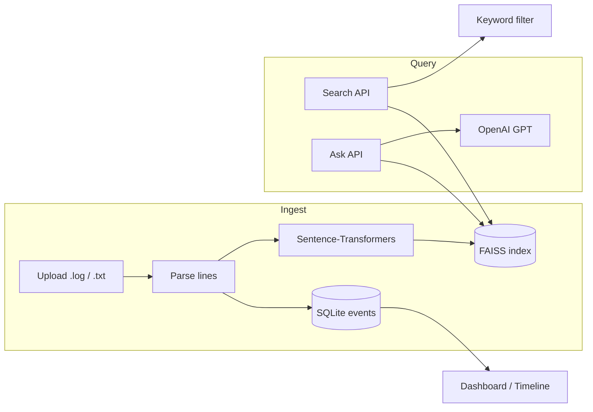

# AI Log Analyzer Agent

A full-stack **RAG (Retrieval-Augmented Generation)** app for SCADA and field-operation logs: upload logs, search with embeddings + keyword filtering, ask grounded questions via OpenAI, and review errors on a dashboard.

## What this is (plain English)

If you work with log files and need to **find problems quickly**, **ask questions in normal language**, or **see what happened over time**, this app helps. You upload logs through a simple web page; the system reads them, indexes them, and lets you search, chat with an AI assistant about them, and view errors and timelines on a dashboard.

**You do not need to be a developer to use the app** once it is running: open the site in your browser, upload files, and follow the on-screen pages (Upload → Search / Chat / Dashboard). Developers get API access, local setup, and the technical details below.

---

## Try the agent (quick path)

1. **Run the app** — Follow [How to run (local development)](#how-to-run-local-development): start the backend, then the frontend (two terminals).
2. **Open the website** — Go to **http://localhost:3000**.
3. **Upload a log file** — Use **Upload**, wait until processing finishes.
4. **Explore** — Use **Search** to find lines (by default, results favor lines that **literally contain your search words**), **Ask** to chat about the logs (needs an OpenAI key), or **Dashboard** for anomalies and a timeline.

If something fails, see [Troubleshooting](#troubleshooting). For every setting and env variable, see [ENV_SETUP.md](./ENV_SETUP.md).

### Demo walkthrough (~2 minutes)

Use the included sample file `samples/scada_system.log`:

1. **Upload** — Drag `samples/scada_system.log` onto the Upload page; confirm the success message with an event count.
2. **Search** — Search for `timeout` or `error`; results should include NetworkManager connection failures.
3. **Ask** — Open Chat and ask: *"What connection errors occurred and which devices were affected?"* (requires `OPENAI_API_KEY` in `backend/.env`).
4. **Dashboard** — Confirm error/warning counts and the chronological timeline.

For a portfolio README, add screenshots to `docs/screenshots/` (home, upload success, search results, chat answer, dashboard) and link them here.

---

## Features

- **Upload Log Files** — Drag and drop `.log`, `.txt`, or `.json` files for parsing and indexing
- **Search** — FAISS semantic retrieval with optional keyword filtering (default: lines must contain your query terms, ranked by relevance)
- **Ask Questions (RAG)** — GPT answers grounded in retrieved log excerpts (requires OpenAI API key)
- **Error & Warning Dashboard** — Surfaces `ERROR`, `CRITICAL`, and `WARN` events from parsed logs (rule-based, not ML anomaly scoring)
- **Event Timeline** — Chronological list of parsed events (paginated in the UI)
- **Basic Summarize API** — Event/error counts per file (`POST /api/summarize`); LLM summarization not implemented yet

## Architecture



**Design notes (good interview talking points):**

- Each log line is embedded with `all-MiniLM-L6-v2` and stored in a local FAISS `IndexFlatL2` index.
- Search pulls a wide semantic candidate pool, then (by default) keeps only lines whose text contains query terms ≥2 characters.
- `/api/ask` retrieves top-k neighbors, builds a prompt from those excerpts, and calls OpenAI — classic RAG, with evidence returned to the UI.

## Tech Stack

- **Backend**: FastAPI (Python)
- **Frontend**: Next.js (React + TypeScript)
- **Embeddings**: Sentence-Transformers (HuggingFace)
- **Vector Search**: FAISS
- **Database**: SQLite
- **LLM**: OpenAI GPT-4o-mini

## Prerequisites

- Python 3.8+
- Node.js 18+ and npm
- OpenAI API key ([Get one here](https://platform.openai.com/api-keys)) — required for **Ask Questions** (`/api/ask`). Upload, search, dashboard, and timeline work without it.

## How to run (local development)

Run the **backend** and **frontend** in two separate terminals. Start the backend first so the API is available when the UI loads.

### 1. Backend (FastAPI)

From the repository root:

```bash
cd backend

# Virtual environment (recommended)
python -m venv venv

# Activate: Windows (cmd/PowerShell)
#   venv\Scripts\activate
# Activate: Windows (Git Bash) / macOS / Linux
source venv/bin/activate

pip install -r requirements.txt
```

Create `backend/.env` with at least:

```bash
OPENAI_API_KEY=your_openai_api_key_here
```

Optional: `OPENAI_MODEL=gpt-4o-mini`, `EMB_MODEL=all-MiniLM-L6-v2`, see [ENV_SETUP.md](./ENV_SETUP.md).

Start the server (run this from the **`backend`** folder so paths like `./data/` resolve correctly):

```bash
uvicorn app:app --reload --port 8000
```

- API base URL: **http://localhost:8000**
- Interactive docs: **http://localhost:8000/docs**

On first run, the embedding model may download from Hugging Face (can take a minute).

### 2. Frontend (Next.js)

In a **second** terminal, from the repository root:

```bash
cd frontend
npm install
```

Create `frontend/.env.local`:

```bash
NEXT_PUBLIC_API_URL=http://localhost:8000
```

If the backend uses another host or port, set that URL here. Restart `npm run dev` after changing `.env.local`.

Start the dev server:

```bash
npm run dev
```

- App: **http://localhost:3000**

### 3. Use the app

| Page        | URL                     | What it’s for |
|------------|-------------------------|----------------|
| Home       | http://localhost:3000   | Overview and navigation |
| Upload     | http://localhost:3000/upload   | Add log files |
| Search     | http://localhost:3000/search   | Find lines in indexed logs |
| Ask (RAG)  | http://localhost:3000/chat     | Ask questions in plain language (needs API key) |
| Dashboard  | http://localhost:3000/dashboard | Errors, warnings, and timeline |

### Production build (frontend)

```bash
cd frontend
npm run build
npm start
```

Point `NEXT_PUBLIC_API_URL` at your deployed API URL. Serve the FastAPI app separately (e.g. uvicorn behind a reverse proxy).

## Project Structure

```
ai-log-agent/
├── backend/
│   ├── app.py              # FastAPI routes
│   ├── db.py               # SQLite operations
│   ├── embeddings.py       # FAISS + Sentence-Transformers
│   ├── keyword_helpers.py  # Keyword filter for search
│   ├── parsers.py          # Log line parsing
│   └── requirements.txt
├── frontend/               # Next.js UI
├── samples/                # Example log files for demos
├── tests/                  # Pytest (API smoke + unit tests)
├── docs/screenshots/       # Add demo screenshots for your portfolio
└── README.md
```

## Environment Variables

See [ENV_SETUP.md](./ENV_SETUP.md) for full details.

### Backend (`backend/.env`)

```bash
OPENAI_API_KEY=your_key_here
OPENAI_MODEL=gpt-4o-mini
EMB_MODEL=all-MiniLM-L6-v2
# Optional: stricter/looser semantic match for search & ask (FAISS squared L2; default 1.2)
SEARCH_MAX_L2_DISTANCE=1.2
# Optional: size of semantic candidate pool before keyword filter (default 2500, max 10000)
SEARCH_SEMANTIC_POOL=2500
```

### Frontend (`frontend/.env.local`)

```bash
NEXT_PUBLIC_API_URL=http://localhost:8000
```

## Usage

1. **Upload Logs**: Open Upload and drag and drop log files (for example `.log`, `.txt`). Wait until the file is indexed.
2. **Search**: Enter words you care about (e.g. `error`, `timeout`). Results prioritize lines that contain those words.
3. **Ask Questions**: Open Ask / Chat and type a question in plain language (requires OpenAI key in `backend/.env`).
4. **Dashboard**: See counts of errors and warnings and a chronological timeline of events.

## API Endpoints

- `POST /api/upload` - Upload log files
- `POST /api/search` - Search in logs (optional body field `keyword_only`; default favors literal keyword matches)
- `POST /api/ask` - Ask questions about logs (RAG)
- `POST /api/summarize` - Basic stats for a file (event/error counts)
- `GET /api/anomalies` - ERROR / CRITICAL / WARN events (most recent 100)
- `GET /api/timeline` - Event timeline (optional `file_id` query)
- `GET /api/file/{file_id}/status` - File processing status

See http://localhost:8000/docs for interactive API documentation.

## Tests

From the repository root (after `pip install -r backend/requirements.txt -r backend/requirements-dev.txt`):

```bash
python -m pytest
```

CI runs backend tests and frontend ESLint on push/PR to `main`.

## Development shortcuts

**Backend**

```bash
cd backend
# activate venv first
uvicorn app:app --reload --port 8000
```

**Frontend**

```bash
cd frontend
npm run dev
```

## Troubleshooting

### Backend

**"OPENAI_API_KEY not configured"** (when using Ask)

- Add `OPENAI_API_KEY` to `backend/.env` in the `backend/` folder.

**"ModuleNotFoundError"**

- Activate the virtual environment and run `pip install -r requirements.txt`.

**Wrong or empty data / database issues**

- Start `uvicorn` from the **`backend`** directory so `./data/metadata.db` and the FAISS index paths are correct.

### Frontend

**API calls failing**

- Ensure the backend is running on the port in `NEXT_PUBLIC_API_URL`.
- Restart `npm run dev` after editing `.env.local`.

**CORS errors**

- The backend allows all origins in development; confirm the API URL is correct.

## Production Deployment

See [ENV_SETUP.md](./ENV_SETUP.md) for production deployment notes.
